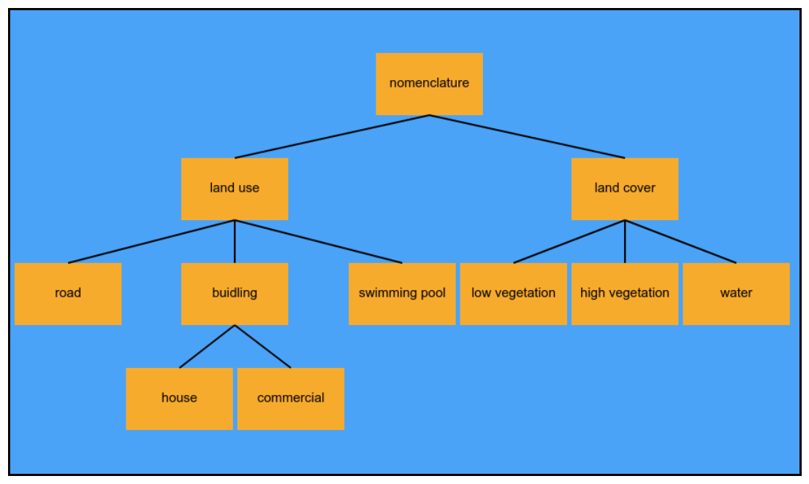

# mrtree
A simple javascript module for drawing interactive tree diagrams.



## How to use it ?

First create an html file and fill the body with a div container with an id equal to mtcontainer

```
<div id="mtcontainer"></div>
```
Then create a js file where you have to create a json tree. Each node must have at least two keys: name and childs.

Below is an example of such a tree:

```
const mytree = {
  "name": "nomenclature",
  "childs": [
    {
      "name": "land use",
      "childs": [
        {
          "name": "road",
          "childs": []
        },
        {
          "name": "buidling",
          "childs": [
            {
              "name": "house",
              "childs": []
            },
            {
              "name": "commercial",
              "childs": []
            }
          ]
        },
        {
          "name": "swimming pool",
          "childs": []
        },
      ]
    }
```

You can interact with the tree. To do so, you must create a class to handle click interaction.

Here is an example of such a class:

```
class TreeInteraction {
  constructor() {
  }
  onClickNode(node) {
    alert(node.m_Name);
  }
}
```

Finally, you can instantiate MrTree like this:


```
const myConfig = {
  "tree": mytree,
  "interact": new TreeInteraction()
}

const mrTree = new MrTree(myConfig);
```

You have a full example in the example directory.


Dont hesitate to suggest new features or to contribute :)

## Author
Pierre Lassalle
